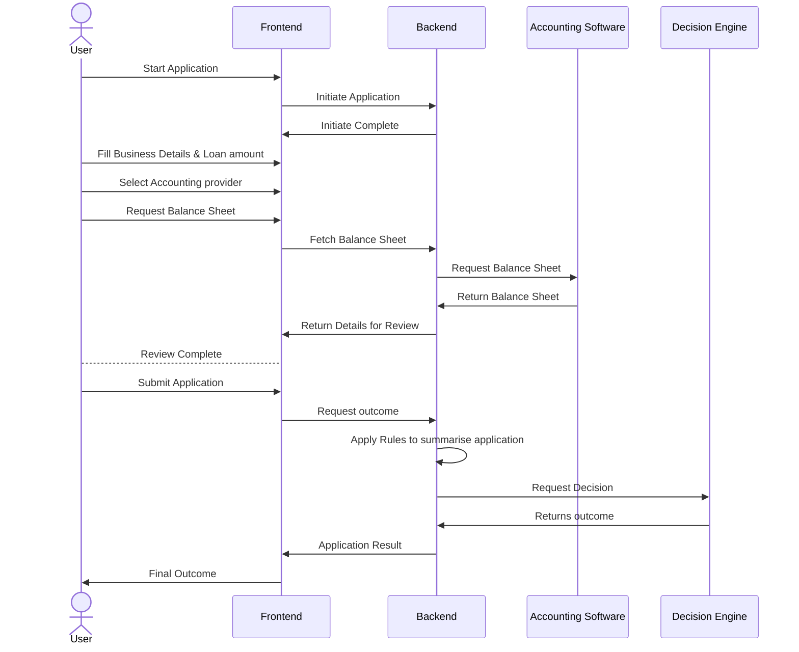

# Instructions
# Exercise

The goal of the project is to build a simple business loan application system.

The system consists of the following:

- Frontend
- Backend

The backend would integrate with third-party providers such as:

- Decision engine - This is where the final application will be
submitted to present the outcome of the application.
- Accounting software providers will provide a balance sheet for a selected business of the user.

Below is a sequence diagram to help visually understand the flow.



Assumptions:

- You may choose from the following language: Javascript, Typescript, Python, Golang / HTML, CSS.
- For frontend, you could use a framework such as React / Vue, though basic HTML is also acceptable.
- The accounting software and decision engine are already implemented. The backend should provide a simulation of the above.
- The frontend can be very basic.
- The accounting provider option on frontend would include Xero, MYOB and more in future.
- A sample balance sheet received from Accounting provider:

```json

sheet = [
    {
        "year": 2020,
        "month": 12,
        "profitOrLoss": 250000,
        "assetsValue": 1234
    },
    {
        "year": 2020,
        "month": 11,
        "profitOrLoss": 1150,
        "assetsValue": 5789
    },
    {
        "year": 2020,
        "month": 10,
        "profitOrLoss": 2500,
        "assetsValue": 22345
    },
    {
        "year": 2020,
        "month": 9,
        "profitOrLoss": -187000,
        "assetsValue": 223452
    }
]
```

## Rules to be applied before sending to Decision Engine

- If a business has made a profit in the last 12 months. The final value to be sent with a field `"preAssessment": "60"` which means the Loan is favored to be approved 60% of the requested value.
If the average asset value across 12 months is greater than the loan amount then `"preAssessment": "100"`
- Default value to be used `20`

## The Final output to be sent to the decision engine would contain minimum details such as

- Business Details such as:
  - Name
  - Year established
  - Summary of Profit or loss by the year
- preAssessment value as per the rules

## Judging Criteria

- Engineering principles & standards
- System extensibility & Scalability
- Testability
- Brevity and Simplicity

## Bonus Points

- Docker

## FAQ

### What is the time-limit on exercise ?

There is none, ensure you submit your best attempt and as soon as you possibly can.

### How to submit ?

Submit a GitHub / Bitbucket repo for review. No ZIP files!

## How tu run

This is a [Next.js](https://nextjs.org/) project bootstrapped with [`create-next-app`](https://github.com/vercel/next.js/tree/canary/packages/create-next-app).

## Getting Started

First, run the development server:

```bash
npm run dev
# or
yarn dev
# or
pnpm dev
# or
bun dev
```

Open [http://localhost:3000](http://localhost:3000) with your browser to see the result.

You can start editing the page by modifying `app/page.tsx`. The page auto-updates as you edit the file.

This project uses [`next/font`](https://nextjs.org/docs/basic-features/font-optimization) to automatically optimize and load Inter, a custom Google Font.

## Learn More

To learn more about Next.js, take a look at the following resources:

- [Next.js Documentation](https://nextjs.org/docs) - learn about Next.js features and API.
- [Learn Next.js](https://nextjs.org/learn) - an interactive Next.js tutorial.

You can check out [the Next.js GitHub repository](https://github.com/vercel/next.js/) - your feedback and contributions are welcome!

## Deploy on Vercel

The easiest way to deploy your Next.js app is to use the [Vercel Platform](https://vercel.com/new?utm_medium=default-template&filter=next.js&utm_source=create-next-app&utm_campaign=create-next-app-readme) from the creators of Next.js.

Check out our [Next.js deployment documentation](https://nextjs.org/docs/deployment) for more details.
